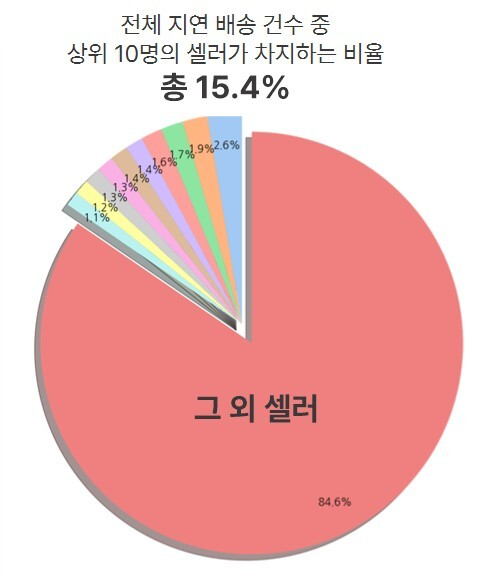

# E‑Commerce Data Analysis

> 본 프로젝트는 Olist가 제공하는 E‑Commerce Public Dataset을 활용하여 Olist의 주문·리뷰 데이터를 분석해 배송 지연이 고객 만족도에 미치는 영향을 규명하고, 삼양 불닭볶음면의 현지 진입을 위해 ‘3일 SLA·셀러 trust score·이중 물류센터’ 전략을 제안한 데이터 기반 물류 최적화 프로젝트입니다.
> 

---

## [1] 분석 개요

- **분석 질문**: 
    - 브라질 시장에서 불닭볶음면이 잘 팔릴 수 있을까?
    - 배송지연을 자주 일으키는 셀러들의 지연 건수가 전체 지연 건수 중 유의미한 비율을 차지할까?
    - 배송지연과 고객 만족도(별점) 간 상관관계가 있을까?
    - 배송지연은 어느 단계에서 일어날까?(출고지연, 운송지연)
    - 출고지연과 운송지연 간 상관관계가 있을까?
    - 물류센터를 브라질 어느 지역에 지어야 불닭볶음면 판매율을 높일 수 있을까?
    - 신뢰할만한 셀러를 다수 확보하기 위해 어떤 관리 방안을 실시해야 할까?
- **기대 효과**: 
    - 신뢰할만한 셀러 다수 확보
    - 브라질 시장 내 불닭볶음면 판매 증대
    - 브라질 시장 내 불닭볶음면 안정적 공급
    - 삼양 및 Olist 간 플랫폼 파트너십 강화

---

## [2] 주요 분석 결과

분석을 통해 도출한 핵심적인 인사이트와 시각화 자료를 요약하여 보여줍니다.

- **인사이트 1**: 브라질을 비롯한 남미 인구의 경우 매운 맛에 대한 선호도가 낮아 불닭볶음면과 같은 매운 맛에 대한 수요가 적었다. 하지만 최근 틱톡과 같은 숏폼 컨텐츠을 통한 관심의 증가로 백인, 흑인들의 매운 맛 수요가 증대될 것으로 예상되어 매운맛 선점이 필요할 것으로 보인다. 
  
  
    

- **인사이트 2**:  배송지연 건수 Top10 셀러가 평균 10.56일의 지연을 일으켰고, 이들이 지연배송 건수의 합이 지연 배송의 15.4%나 되어 소수의 셀러가 배송지연을 유의미하게 일으키고 있다고 볼 수 있다.
  
- **인사이트 3**:  p-value를 통해서 배송지연 여부와 별점 간 상관관계를 분석한 결과 배송지연이 고객 만족도에 영향을 미친다는 것을 알 수 있다.
- **인사이트 4**:  출고지연은 전체 주문의 9.3%에서 발생하며, 평균 지연일은 2.6일이다. 운송지연은 전체 주문의 7.9% 발생했지만, 평균 지연일은 8.7일로 체감은 훨씬 심각하다. 결과적으로 출고지연은 자주 발생하며 운송 지연은 상대적으로 적게 발생하지만, 피해는 더 크다는 것을 알 수 있다.
  
- **인사이트 5**: **소비자 친화 물류 센터** 로는 마나우스(in 아마조나스), 포르투벨류(in 론도니아), 마카파(in 아마파), 리우 브랑쿠(in 아크리)를 추천한다. 
4곳은 각 주의 주도이며, 주 전체 인구의 절반 이상이 거주한다.
- **인사이트 6**: **불닭볶음면 전용 물류 센터** 로는 포르탈레자(in 세아라), 사오 루이스(in 마라냥), 마세이오(in 알라고아스), 테레지나(in 파아우이), 아라카주(in 세르지피)를 추천한다. 일부는 항만이 있는 도시들이며, 고속도로 및 도로기반이 있어 물류망 존재
- **인사이트 7**: 높은 품질의 배송을 보여준 셀러들에겐 "프리미엄 셀러 뱃지" 부여하여 제품 공급 우선권 부여한다. 이외의 셀러들에게 교육 및 가이드 제공하여 셀러를 관리한다. 차후 날씨, 교통 데이터를 활용한 배송 지원 방안 구축한다.


> 사용 기술
> 

```
- Language: Python 3.11
- Libraries: Pandas, Matplotlib, Seaborn 등
- Environment: Jupyter Notebook
```

## [3] 프로젝트 구조

```
0707_sesac_miniproject-Public/
├── README.md
├── .gitignore
├── daily_logs
│   ├── 새싹 1차 미니프로젝트 진행.pdf
│   └── 새싹 5팀_발표자료_ver9_250707.pdf
├── notebooks/
│   ├── code정리_5팀_안재룡.ipynb
│   ├── Olist_data_analyzing_이한별.ipynb
│   ├── project1_used_code_minji.ipynb
│   ├── 20250702_새싹프로젝트_오상준.ipynb
│   └── analysis.ipynb
└── data/   (※ 실제 저장소에는 포함하지 않으며, .gitignore로 관리)
```

## [4] 데이터셋 안내

이 프로젝트는 데이터 파일을 직접 저장소에 포함하지 않습니다.
데이터셋은 아래 링크를 통해 다운로드하신 후, 로컬 환경의 `data/` 폴더에 직접 저장해 주시기 바랍니다.

- **Dataset:** E‑Commerce Public Dataset by Olist
- **Provider:** Olist (via Kaggle)
- **Original Link:** [Kaggle URL](https://www.kaggle.com/datasets/olistbr/brazilian-ecommerce)
- **License:** [CC BY-NC-SA 4.0](https://creativecommons.org/licenses/by-nc-sa/4.0/)

**※ 다운로드 방법**

1. 위의 Kaggle 링크에서 데이터셋을 다운로드합니다.
2. 본인의 로컬 저장소 내에 `data/` 폴더를 생성하고, 압축을 해제한 csv 파일을 해당 폴더에 저장합니다.

---

## [5] 데이터셋 라이선스 및 사용 조건

`CC BY-NC-SA 4.0` 라이선스를 따르므로, 데이터 사용 시 해당 라이선스 규정을 준수해야 합니다. 데이터의 상업적 이용 및 원본 라이선스와 다른 조건의 2차 배포는 금지됩니다.
자세한 사항은 [CC BY-NC-SA 4.0 라이선스 안내](https://creativecommons.org/licenses/by-nc-sa/4.0/)를 참고하시기 바랍니다.